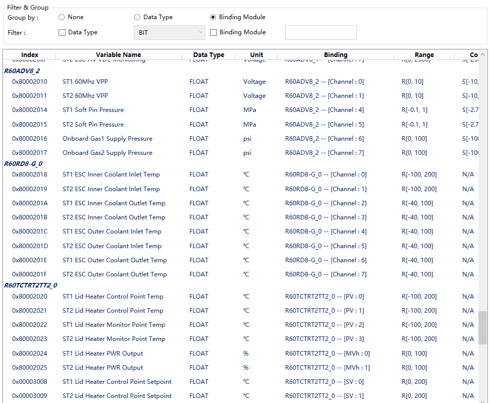

# IO Celceta

A graphical user interface for *Foliage Ocean IO List*.

## Table of contents

- [License](#license)

- [Introduction](#introduction)

- [Usage](#usage)

  - [Import Metadata](#import-metadata)
  - [Metadata Viewer](#metadata-viewer)
  - [Create](#create)
  - [Open](#open)
  - [Save](#save)
  - [Save As](#save-as)
  - [Edit](#edit)
    - [Target Info](#target-info)
    - [Controller Info](#controller-info)
      - [MC Server Info](#mc-server-info)
      - [Extension Modules](#extension-modules)
        - [Extension Module Detail](#extension-module-detail)
      - [Ethernet Modules](#ethernet-modules)
        - [Ethernet Module Detail](#ethernet-module-detail)
    - [Object Collection](#object-collection)
      - [Object Filter & Group](#object-filter-&-group)
      - [Object Data Detail](#object-data-detail)
    - [PDO & Interlock](#pdo-&-interlock)
      - [Object Viewer Filter & Control](#object-viewer-filter-&-control)
      - [How to Edit Interlock Logic](#how-to-edit-interlock-logic)
  - [Exception](#exception)
  - [Notes](#notes)

  

## License

TBD

## Introduction

IO Celceta is originally developed as an user-friendly tool to create or edit *Foliage Ocean IO List*. 

I strongly recommend that you take some time to read *Foliage Ocean IO List* documents before you continue with this document.

## Usage

### Import Metadata

All metadata files(***controller_model_catalogue.xml, data_type_catalogue.xml, variable_catalogue.xml***) should be copy to the ***Metadata*** folder exists in the same directory as ***IOCelceta.exe*** before you launch tool. 

Metadata files should be created by users, please refer to *Foliage Ocean IO List* documents for details.

The tool will load metadata files into memory at the beginning. Exception will be thrown if any error is found in metadata files. Please refer to [Exception](#exception) for details.

You must restart the app for newly imported metadata to take effect.

### Metadata Viewer

You can open *Metadata Viewer* by a menu item or shortcut key.

> Tool -> Catalogue

or

> Ctrl+C

The three tabs correspond to ***controller_model_catalogue.xml, data_type_catalogue.xml and variable_catalogue.xml*** respectively.

<b><em>Figure 1.</em></b> <em>Metadata Viewer</em>

### Create

You can create a new *Foliage Ocean IO List* by a menu item or shortcut key.

> File-> New

or

> Ctrl+N

### Open

You can open an existing *Foliage Ocean IO List* by a menu item or shortcut key.

> File-> Open

or

> Ctrl+O

### Save

You can save the *Foliage Ocean IO List* you are working on by a menu item or shortcut key.

> File-> Save

or

> Ctrl+S

### Save As

You can save the *Foliage Ocean IO List* you are working on as another separate file by a menu item or shortcut key.

> File-> Save As

or

> Ctrl+Shift+S

### Edit

#### Target Info

<b><em>Figure 2.</em></b> <em>Target Info</em>

The contents in `Target Info` tab can be arbitrary text depends on the user.

#### Controller Info

<b><em>Figure 3.</em></b> <em>Controller Info</em>

##### MC Server Info

<b><em>Figure 4.</em></b> <em>MC Server Info</em>

You can input controller Melsec Protocol server IP address and port here. 

The IP address and port can be used as a controller identity address, and GUI PC can also access controller through the IP address and port (via Mitsubishi Melsec Protocol).

##### Extension Modules

<b><em>Figure 5.</em></b> <em>Extension Modules</em>

This section lists the extension modules in *Foliage Ocean IO List*.

You can use context menu items or the buttons at the bottom of the section to edit the list.

**Command**

`Add`

Add a new extension module, see also [Extension Module Detail](#extension-module-detail).

`Insert`

Insert a new extension module before the selected module, see also [Extension Module Detail](#extension-module-detail).

`Edit`

Edit the selected module. It is impossible to submit a change request to a module referenced by [Object Collection](#object-collection).  See also [Extension Module Detail](#extension-module-detail). 

`Remove`

Remove the selected module. It is impossible to remove a module referenced by [Object Collection](#object-collection).

`Move Up`

Move the selected module up.

`Move Down`

Move the selected module down.

###### Extension Module Detail

<b><em>Figure 6.</em></b> <em>Extension Module Detail Info</em>

**Field**

`Model Selection`

Select the model of extension module.

`Device Switch`

Input module switch value, the value must be a 32-bit unsigned hexadecimal integral number literal (begins with 0x).

`Local Address`

Input module local address, the address must be a 16-bit unsigned hexadecimal integral number literal (begins with 0x).

`Reference Name`

Input an alias for the module,  can be arbitrary string but must be different from aliases of modules in extension module list and ethernet module list.

##### Ethernet Modules

<b><em>Figure 7.</em></b> <em>Ethernet Modules</em>

This section lists the ethernet modules in *Foliage Ocean IO List*.

You can use context menu items or the buttons at the bottom of the section to edit the list.

**Command**

`Add`

Add a new ethernet module, see also [Ethernet Module Detail](#ethernet-module-detail).

`Insert`

Insert a new ethernet module before the selected module, see also [Ethernet Module Detail](#ethernet-module-detail).

`Edit`

Edit the selected module. It is impossible to submit a change request to a module referenced by [Object Collection](#object-collection). See also [Ethernet Module Detail](#ethernet-module-detail).

`Remove`

Remove the selected module. It is impossible to remove a module referenced by [Object Collection](#object-collection).

`Move Up`

Move the selected module up.

`Move Down`

Move the selected module down.

###### Ethernet Module Detail

<b><em>Figure 8.</em></b> <em>Ethenet Module Detail Info</em>

**Field**

`Model Selection`

Select the model of ethernet module.

`Device Switch`

Input module switch value, the value must be a 32-bit unsigned hexadecimal integral number literal (begins with 0x).

`IP Address`

Input module IP address.

`Port`

Input module port number. the port number must be a 16-bit unsigned decimal integral number literal.

`Reference Name`

Input an alias for the module,  can be arbitrary string but must be different from aliases of other modules in extension module list and ethernet module list.

#### Object Collection

<b><em>Figure 9.</em></b> <em>Object Collection</em>

The tab list all object definitions, and also you can use context menu items or the buttons at the bottom of the tab content to edit the list.

A simple tool is provided for you to check object definitions in a more convenient way. See also [Object Filter & Group](#object-filter-&-group).

**Command**

`Add`

Add a new object definition, see also [Object Data Detail](#object-data-detail).

`Insert`

Insert a new object definition before the selected one, see also [Object Data Detail](#object-data-detail).

`Edit`

Edit the selected object definition. It is impossible to submit a change request to an object definition referenced by [PDO Collection](#pdo-&-interlock). See also [Object Data Detail](#object-data-detail).

`Remove`

Remove the selected object definition. It is impossible to remove a object definition referenced by [PDO Collection](#pdo-&-interlock). 

`Move Up`

Move the selected object definition up.

`Move Down`

Move the selected object definition down.

###### Object Filter & Group

<b><em>Figure 10.</em></b> <em>Object Filter &amp; Group</em>

**Field**

`Group by`

You can group object definition by *Data Type*.

<b><em>Figure 11.</em></b> <em>Group by Data Type</em>

Or *Binding Module*.

<b><em>Figure 12.</em></b> <em>Group by Binding Module</em>

`Filter`

You can filter object definition by *Data Type*.

<b><em>Figure 13.</em></b> <em>Filter by Data Type</em>

Meanwhile， you can filter object definition by *Binding Module*,  the list will show all object definitions of which the binding module name begins with the specified string.  

The following figure shows all object definitions whose binding module begins with "RJ" , as well as of `FLOAT` data type.

<b><em>Figure 14.</em></b> <em>Filter by Binding Module</em>

Note: The object definition list is refreshed in the following cases:

- Check/Uncheck the corresponding check box;
- When `Data Type` check box is checked, change the selected item of data type combo box;
- When `Binding Module` check box is checked, change the binding module name string and press Enter key;

###### Object Data Detail

<b><em>Figure 15.</em></b> <em>Object Data Detail</em>

**Field**

`Basic Info - Index`

A unique ID assigned to each object definition, must be a 32-bit unsigned hexadecimal integral number literal (begins with 0x). For Tx data objects, the highest bit of `index` must be 1, for Rx data objects, the most highest bit of `index` must be 0.

`Basic Info - Var Name`

Variable name, must be a valid variable defined in metadata (variable_catalogue.xml). You can get the list of variable name by [Metadata Viewer](#metadata-viewer).

`Binding - Enable`

Enable or disable module binding.

`Binding - Module`

Select a valid controller module via module alias (defined in [Controller Info](#controller-info)).

`Binding - Channel` `Binding - Index`

The available channel names and index range depend on the model of the selected module. The details can be obtained from metadata (controller_model_catalogue.xml).  Also, you can browsing the available channel names and index range by [Metadata Viewer](#metadata-viewer).

`Range - Enable`

Enable or disable range settings.

`Range - Dw Limit` `Range - Up Limit`

Down limit and up limit of range. These fields can be arbitrary string, the app do not set any restriction on the values of these fields.

`Converter - Enable`

Enable or disable converter settings.

`Converter - Dw Scale` `Converter - Up Scale`

Down scale and up scale of converter. These fields should be signed decimal floating point number literal. The number gives up to 17 significant digits of precision.

#### PDO & Interlock

<b><em>Figure 16.</em></b> <em>PDO Collection &amp; Interlock</em>

The left side of the window (hereinafter referred to as *PDO Mappings*) shows PDO mappings and interlock definitions, while the right side (hereinafter referred to as *Object Viewer*) shows available objects defined in [Object Collection](#object-collection), and also, a simple tool is provided for you to check object definitions in a more convenient way. See also [Object Viewer Filter & Control](#object-viewer-filter-&-control).

The contents of five tabs in *PDO Mappings* correspond to *Tx Diagnostic Area, Tx Bit Area, Tx Block Area, Rx Control Area, Rx Bit Area, Rx Block Area* and *Interlock Area* respectively.

You can edit the first four areas in a very similar way. The `Offset In Word` and `Size In Word` are used to define the memory offset and memory size requirement of the area. The `Actual Size In Byte` is a read-only field and its value is calculate by application, it indicate the minimal memory size requirement of this area according to PDOs in this area. You can use context menu items or the buttons at the bottom of window to edit the PDO list. 

For *Interlock Area*, please consult to [How to Edit Interlock Logic](#how-to-edit-interlock-logic).

**Command**

`Add`

Append the selected object definition in *Object Viewer* to current PDO mapping area.

`Insert`

Insert the selected object definition in *Object Viewer* before the selected object definition in current PDO mapping area.

`Edit`

Apply to *Interlock Area* only, please consult to [How to Edit Interlock Logic](#how-to-edit-interlock-logic).

`Replace`

Replace the selected object definition in current PDO mapping area with the selected object definition in *Object Viewer* before.

`Remove`

Remove the selected object definition in current PDO mapping area.

`Move Up`

Move the selected object definition in current PDO mapping area up.

`Move Down`

Move the selected object definition in current PDO mapping area down.

`Group`

Apply to *Rx Bit Area* and *Tx Bit Area*.

Sort all object definitions in current PDO mapping by their `Binding` property value in ascending order.

###### Object Viewer Filter & Control

<b><em>Figure 17.</em></b> <em>Object Viewer Filter &amp; Control</em>

**Field**

`Data Type`

Check the check box to enable Data Type filter, the *Object Viewer* will filter out all object definitions of which the data type literal is  different from the input string.

`Variable Name`

Check the check box to enable Variable Name filter, the *Object Viewer* will show all object definition of which the variable name is a sub-string of the input string.

`Binding Module`

Check the check box to enable Binding Module filter, the *Object Viewer* will show all object definitions of which the binding module name begins with the input string.  

Note: The object definition list is refreshed in the following cases:

- Check/Uncheck the corresponding check box;
- When the check box is checked, change the text of the corresponding text box and press Enter key;

###### How to Edit Interlock Logic

<b><em>Figure 18.</em></b> <em>Interlock Logic Editor</em>

The upper half of this figure shows a list of interlock logic definitions. And the bottom half shows the interlock logic currently being editing. The `Commit`  command is used to commit changes and the `Cancel` command is used to discard changes. For a complete introduction to interlock logic, please consult to *Foliage Ocean IO List* documents.

You can use context menu items or the buttons at the bottom of window to edit the list of interlock logic definitions.

**Command**

`Add`

Append a new interlock logic definition.

`Insert`

Insert a new interlock logic definition before the selected one.

`Edit`

Edit the selected interlock logic definition.

`Remove`

Remove the selected interlock logic definition.

`Move Up`

Move the selected interlock logic definition up.

`Move Down`

Move the selected interlock logic definition down.

### Exception

TBD

### Notes

If the command you just issue may result in loss of data, the application will prompt you with the following dialog:

<b><em>Figure 19.</em></b> <em>Discard Changes ?</em>

Press `Y` to continue to execute the command or `N` to abort.

A red `*` will be appended to tab header to indicate that there are unsaved changes in corresponding tab content.

<b><em>Figure 20.</em></b> <em>Changes Detected</em>

