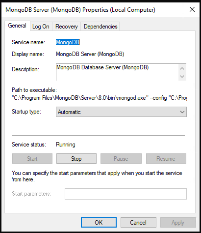
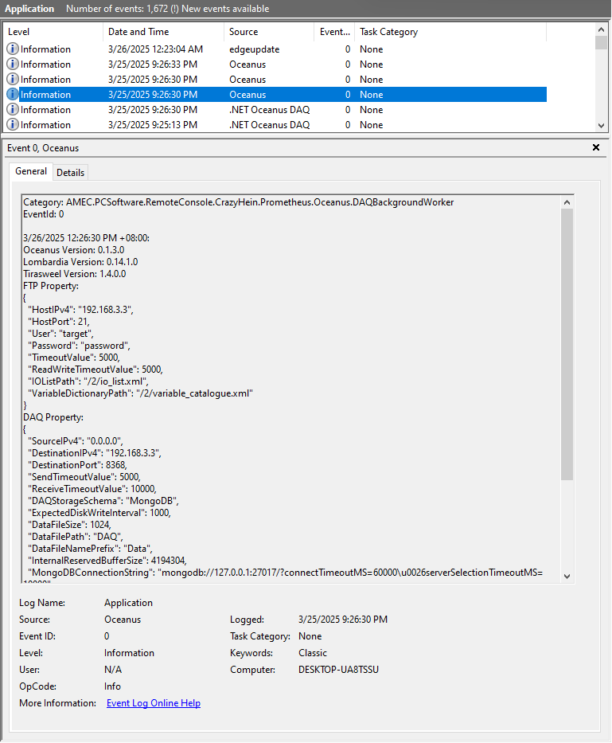
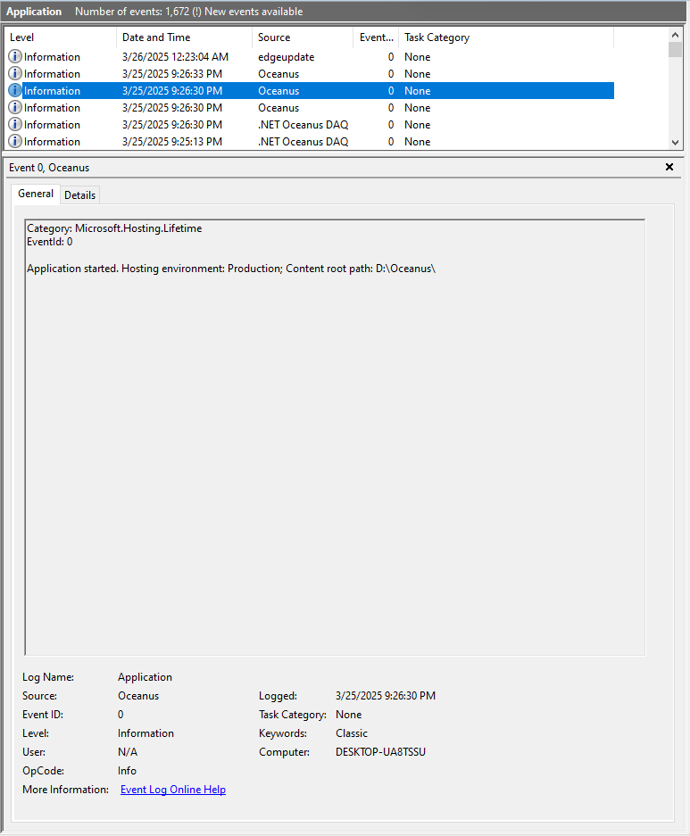
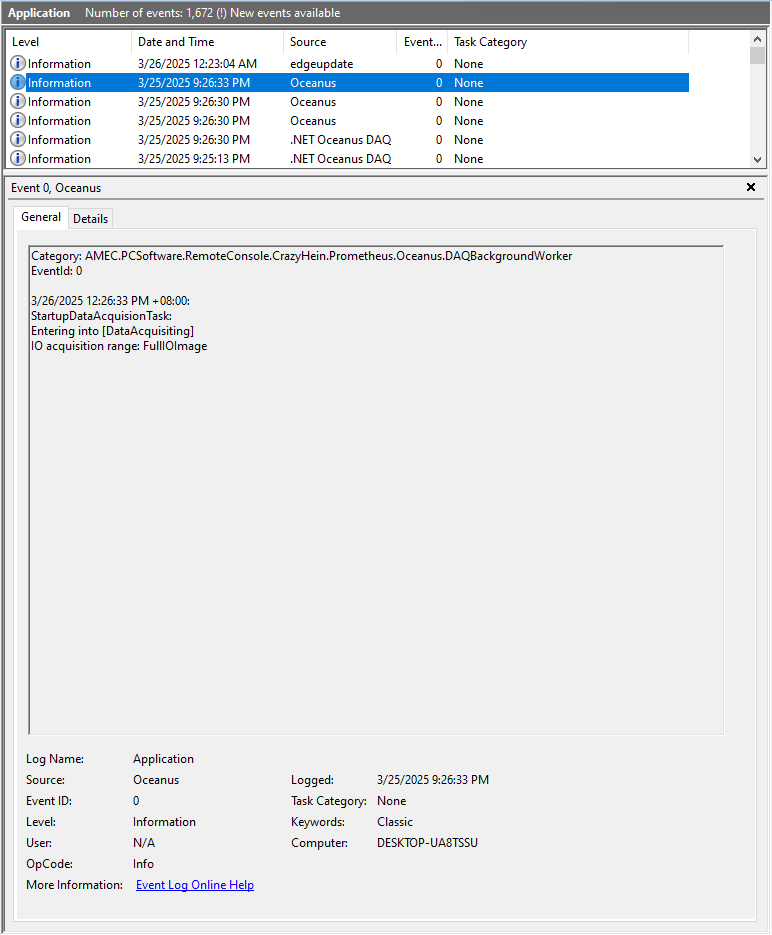

# 概述

“Oceanus”是一个Windows Service，依赖于MongoDB服务，主要提供了以下功能：

1. DAQ客户端， 从运行Orbment Runtime的控制器上读取实时过程数据；

2. 数据存储，将实时过程数据存储到指定的MongoDB数据集中；

3. gRPC服务器，内置的远程管理接口，提供基本的运行状态诊断，数据库检索等功能；


# 构成

“Oceanus”包含以下几个主要组件：

1. “Tirasweel”是一个.Net Core Assembly，使用C#编写，主要提供以下功能：

   1. DAQ客户端，使得用户可以方便地从运行Orbment Runtime的控制器上读取实时过程数据；

   2. 数据存储，自动读取过程数据并将结果存储到CSV文件或者MongoDB数据集中；

   3. 数据检索，从MongoDB数据库中，检索出符合条件的数据（不支持从CSV文件中检索数据）；

2. “Lombardia”是一个.Net Core Assembly，使用C#编写，主要提供以下功能：

   1. 从磁盘文件或者文件流加载Orbment Runtime专用的IO List，解析到C#对象；

   2. 将修改或者编辑过的C#对象保存成Orbment Runtime专用的IO List文件或者文件流；

   3. 将Orbment Runtime专用的IO List导出成AMEC经典格式的IO List；

   4. 从磁盘文件或者文件流加载Orbment Runtime的配置文件，解析到C#对象；

   5. 将修改或者编辑过的C#对象保存成Orbment Runtime配置文件或者文件流；

3. MongoDB Driver由MongoDB提供，提供了应用程序和MongoDB数据库之间的交互接口。

4. gRPC Core，用于构建gRPC的服务端，提供了一种方便的进程间交互手段。


# 用法

## 1. 安装MongoDB社区版

MongoDB社区版的安装包可以从以下网址免费下载：

https://www.mongodb.com/products/self-managed/community-edition

推荐使用8.0版本。

运行安装包完成MongoDB社区版的安装后，你也可以选装官方的管理工具，该工具同样是免费的，可以访问以下网址获取安装包：

https://www.mongodb.com/try/download/compass


## 2. 配置MongoDB Server

首先使用CPU-Z等工具确认主机CPU是否支持AVX和AVX2指令集，如果CPU支持这些高级指令集，则可以跳过这一章，如果不能完全支持这些高级指令集，需要安装以下的说明对MongoDB Server进行适当配置，避免压缩算法导致数据库服务崩溃。



##

## 3. 安装Oceanus服务

使用管理员权限运行Windows的命令提示符，并执行以下命令安装服务：

```powershell
sc create "Oceanus" displayname="Oceanus Service" start=auto  binpath="D:\Oceanus\Oceanus.exe" depend="MongoDB"
```

> 以上的命令创建了名为“Oceanus”（显示名为“Oceanus Service”），用户可以根据自己的偏好随意更换。
>
> `binpath`的值是Oceanus可执行文件的路径，必须根据实际情况修改。


## 4. 配置Oceanus服务

Oceanus的所有配置信息都存放在根目录下的`service_settings.json`文件中，

| Field Name                        | Comment                                                                     | Type | Default                                                                           |
| --------------------------------- | --------------------------------------------------------------------------- | ---- | --------------------------------------------------------------------------------- |
| DAQ.DestinationIPv4               | 控制器IP地址。                                                                    | 字符串  | 192.168.3.3                                                                       |
| DAQ.DestinationPort               | 控制器DAQ协议所监听的端口号。                                                            | 数字   | 8368                                                                              |
| DAQ.SendTimeoutValue              | DAQ端口的发送超时。                                                                 | 数字   | 2000                                                                              |
| DAQ.SendTimeoutValue              | DAQ端口的接收超时                                                                  | 数字   | 10000                                                                             |
| DAQ.DAQStorageSchema              | 数据存储策略，**必须选择MongoDB**，如果选择其他策略，会导致数据检索功能不可用。                               | 字符串  | CSV                                                                               |
| DAQ.MongoDBConnectionString       | MongoDB数据库连接字符串。                                                            | 字符串  | mongodb://localhost:27017/?connectTimeoutMS=60000\&serverSelectionTimeoutMS=10000 |
| DAQ.InternalReservedBufferSize    | 建议的DAQ客户端接收区缓存大小，单位字节。其实设置多少都不影响客户端运行，不过如果能给出准确建议，有利于服务的快速启动。               | 数字   | 4194304                                                                           |
| DAQ.MongoDBDatabaseName           | 数据库名称。                                                                      | 字符串  | DAQ                                                                               |
| DAQ.MongoDBCollectionName         | 数据集名称。                                                                      | 字符串  | Data                                                                              |
| DAQ.MongoDBCollectionSize         | 数据集大小上限，单位字节。如果数据库或者数据集不存在，则会按照这个上限设置，为用户新建一个capped数据集，如果数据集已经存在，则这个设置会被忽略。 | 数字   | 104857600                                                                         |
| DAQ.ExpectedDatabaseWriteInterval | 数据库的写入周期（ms），请根据数据量和PLC端的超时设置合理设置，通常1000-3000。                              | 数字   | 1000                                                                              |
| FTP.HostIPv4                      | 控制器IP地址。                                                                    | 字符串  | 192.168.3.3                                                                       |
| FTP.HostPort                      | 控制器内建FTP服务的端口号。                                                             | 数字   | 21                                                                                |
| FTP.IOListPath                    | 控制器内部存储IO List文件的位置。                                                        | 字符串  | /2/io\_list.xml                                                                   |
| FTP.VariableDictionaryPath        | 控制器内部存储变量字典文件的位置。                                                           | 字符串  | /2/variable\_catalogue.xml                                                        |
| FTP.User                          | 控制器内建FTP服务器的用户名。                                                            | 字符串  | target                                                                            |
| FTP.Password                      | 控制器内建FTP服务器的访问密码。                                                           | 字符串  | password                                                                          |
| FTP.TimeoutValue                  | 控制器内建FTP服务器连接超时值。                                                           | 数字   | 5000                                                                              |
| FTP.ReadWriteTimeoutValue         | 控制器内建FTP服务器文件读写超时值。                                                         | 数字   | 5000                                                                              |
| gRPC.ServerPort                   | Oceanus内建gRPC服务器的端口号。                                                       | 数字   | 50003                                                                             |

每次修改配置文件并保存后，用户应该通过Windows Services Management工具，重启Oceanus服务使配置生效。


## 5. 启动Oceanus服务

配置完成后重启计算机即可启动Oceanus服务。

也可以马上通过Windows Services Management工具启动Oceanus服务。

可以通过Windows Event Viewer查看服务运行情况，如果一切正常，应该能在Event Viewer中找到以下的信息：

服务器版本以及配置信息



服务器根目录



服务器工作状态信息




### 服务器启动流程

#### 5.1 初始化

初始化数据库接口，初始化gRPC服务。

#### 5.2 过程数据组态一致性检查

通过FTP读取离线IO组态，通过DAQ协议读取在线IO组态，检查两个组态是否一致。

#### 5.3 时间戳对齐

对齐控制器ticks和windows的时间戳。

#### 5.4 数据库初始化

根据配置，如果指定的数据库或者数据集不存在，则会按照配置新建数据集，并设置配额大小。

#### 5.5 记录和存储

根据IO组态，通过DAQ协议读取实时过程数据并存入指定的MongoDB数据集。

如果IO组态中不存在任何DAQ标签，那么所有的IO变量均会被记录并存入数据集。

如果IO组态中存在DAQ标签，那么只有被打上DAQ标签的变量会被记录并存入数据集。


## 6. 远程管理

Oceanus内建了gRPC服务器，以下是gRPC的proto文件，用户可以根据proto文件构建自己的gRPC客户端，实现远程状态监视以及数据检索等功能。

```protobuf
syntax = "proto3";

import "google/protobuf/duration.proto";  
import "google/protobuf/timestamp.proto";

option csharp_namespace = "AMEC.PCSoftware.RemoteConsole.CrazyHein.Prometheus.Oceanus.Management";

package AMEC.PCSoftware.RemoteConsole.CrazyHein.Prometheus.Oceanus.Management;

service RemoteManagement {
    /*
     * 读取服务器版本信息的摘要
     */
    rpc QueryVersion(Dummy) returns (VersionSummary);
    /*
     * 读取服务器配置信息的摘要
     */
    rpc QueryConfiguration (Dummy) returns (ConfigurationSummary);
    /*
     * 读取服务器运行状态的摘要
     */
    rpc QueryStatus (Dummy) returns (StatusSummary);
    /*
     * 读取数据库摘要，包括文档数量，时间跨度等信息。
     */
    rpc QueryDatabaseSummary (Dummy) returns (DatabaseSummary);
    /*
     * 以流的形式返回最近几毫秒的文档，毫秒数由用户指定，结果按照时间升序排列。
     */
    rpc QueryDatabaseLatest(LatestDocumentsRequest) returns (stream Document);
    /*
     * 以流的形式返回最新几条文档，数量数由用户指定，结果按照时间降序排列。
     */
    rpc QueryDatabaseHead(NumberOfDocumentsRequest) returns (stream Document);
    /*
     * 以流的形式返回最旧几条文档，数量数由用户指定，结果按照时间升序排列。
     */
    rpc QueryDatabaseTail(NumberOfDocumentsRequest) returns (stream Document);
    /*
     * 根据给定的时间范围，以流的形式返回所有符合条件的文档，结果按照时间升序排列。
     */
    rpc QueryDatabase(ScopeOfDatabaseRequest) returns (stream Document);
    /*
     * 根据给定的wafer hash id，以流的形式返回所有符合条件的文档，结果按照时间升序排列。
     */
    rpc QueryWaferHistory(WaferHistoryRequest) returns (stream Document);
}

message Dummy{}

message VersionSummary{
    string version = 1;
}

message ConfigurationSummary{
    string configuration = 1;
}

message StatusSummary{
    string status = 1;
}

message DatabaseSummary
{
    int64 documents_count = 1;
    google.protobuf.Timestamp start = 2;
    google.protobuf.Timestamp end = 3;
}

message LatestDocumentsRequest
{
    int32 milliseconds = 1;
}

message NumberOfDocumentsRequest
{
    int32 counts = 1;
}

message ScopeOfDatabaseRequest
{
    google.protobuf.Timestamp start = 1;
    google.protobuf.Timestamp end = 2;
}

message WaferHistoryRequest
{
    bytes wafer_hash_code = 1; 
}

message Document
{
    bytes document_in_bson = 1; 
}
```

