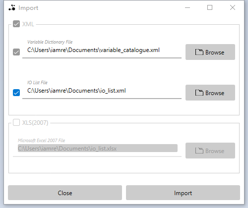
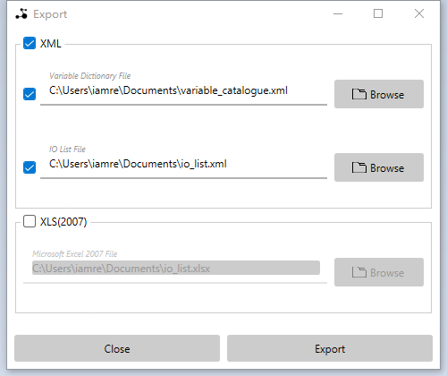

# Seiren

A graphical user interface for  "Foliage Ocean IO List".

## Table of Contents

- [License](#license)

- [Usage](#usage)

  - [Metadata Viewer](#metadata-viewer)

    - [Data Types](#data-types)
    - [Device Models](#device-models)

  - [IO List Editor](#io-list-editor)

    - [Commands](#commands)
      - [New](#new)
      - [Open](#open)
      - [Import/Export](#import/export)
      - [Upload/Download](#upload/download)
      - [Save/Save As](#save/save-as)
      - [Undo/Redo](#undo/redo)
      - [Close](#close)
      - [Quit](#quit)
    - [Variable Dictionary](#variable-dictionary)
    - [Controller Configuration](#controller-configuration)
    - PDO Dictionary
    - Interlock Editor

  - Debugger

    - Start Monitoring
    - Start Debugging
    - Stop Debugging

    - Debugger Status
    - Read Variables
    - Write Variables
    - Interlock Diagnostics

- 2 Appendix

  - Debugger Settings
  - Preference Settings

- 3 Version

## License

TBD

>  TBD

## Usage

### Metadata Viewer

#### Data Types

*Path : Navigator -> Metadata Viewer -> Data Types*

<b><em>Figure 1.</em></b> <em>Data Types Viewer</em>

#### Device Models

*Path : Navigator -> Metadata Viewer -> Device Models*

<b><em>Figure 2.</em></b> <em>Local Extension Models Viewer</em>

<b><em>Figure 3.</em></b> <em>Remote Ethernet Models Viewer</em>

### IO List Editor

#### Commands

##### New

You can create a new *Foliage Ocean IO List* by a menu item or shortcut key.

> File -> New

or

> Ctrl+N

##### Open

You can open an existing *Foliage Ocean IO List* by a menu item or shortcut key.

> File -> Open

or

> Ctrl+O

##### Import/Export

You can import an existing variable dictionary file or IO list file by a menu item or shortcut key.

> Utility -> Import

or

> Ctrl+F2

<b><em>Figure 4.</em></b> <em>Import Utility</em>

*Notes: **Variable Dictionary File** must be selected*.

You can export current  *Foliage Ocean IO List* you are editing to an variable file dictionary file and an IO list or a single Excel achieve file by a menu item or shortcut key.

> Utility -> Export

or

> Ctrl+F3

<b><em>Figure 4.</em></b> <em>Export Utility</em>

##### Upload/Download

You can upload an existing variable dictionary file or IO list file from a FTP server(eg. CPLC) by a menu item or shortcut key.

> Utility -> Upload

or

> Ctrl+F3

*Notes: **Variable Dictionary File** must be selected*

If you want to login the ftp server with anonymous account, just left ***User*** field and ***Password*** field blank.

You can export current  *Foliage Ocean IO List* you are editing to an variable file dictionary file and an IO list and download these file to a FTP server(eg. CPLC) by a menu item or shortcut key.

> Utility -> Download

or

> Ctrl+F4

If you want to login the ftp server with anonymous account, just left ***User*** field and ***Password*** field blank.

##### Save/Save As

You can save current  *Foliage Ocean IO List* you are editing by a menu item or shortcut key.

> File -> Save

or

> Ctrl+S

You can save current  *Foliage Ocean IO List* you are editing as another separate file by a menu item or shortcut key.

> File -> Save As

or

> Ctrl+Shift+S

##### Undo/Redo

Any record operating in IO list can be undo or redo by a menu item or shortcut key.

Undo

> Edit -> Undo

or

> Ctrl+Z

Redo

> Edit-> Redo

or

> Ctrl+Y

##### Close

You can close current  *Foliage Ocean IO List* you are editing by a menu item.

> File -> Close

##### Quit

You can quit the application by a menu item or shortcut key.

> File -> Quit

or

> Ctrl+Q

#### Variable Dictionary

*Path : Navigator -> IO List -> Variable Dictionary*

You can  ***Add***, ***Insert***, ***Edit*** and ***Remove*** variable definition by context menu items or buttons at the bottom.

You also can edit variable definition by double clicking on it.

The ***Set As Default*** menu item in the context menu can set the selected variable definition as the default variable definition which will be used to pre-fill *Add Variable* or *Insert Variable* dialog box.

The names of all variables must be unique.

