# 概述

通过使用“Xandria”软件，可以使用图形化的用户界面创建和编辑Orbment Runtime配置文件，同时，该工具集成了FTP客户端，可以方便快捷地读取/覆盖控制器内的配置文件。

# 用法

## 新建

使用以下的任意一个方法新建配置文件：

* 使用工具栏按钮

* 菜单命令 File -> New

* 快捷键 Ctrl + N

## 打开

### 本地配置文件

使用以下的任意一个方法打开已经保存在磁盘上的配置文件：

* 使用工具栏按钮

* 菜单命令 File -> Open

* 快捷键 Ctrl + O

### 控制器上的配置文件

使用以下的任意一个方法打开保存在控制器上的配置文件：

* 使用工具栏按钮

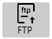

* 菜单命令 Utility -> Upload

* 快捷键 Ctrl + F4

以上方法都会打开“FTP Upload”对话框：

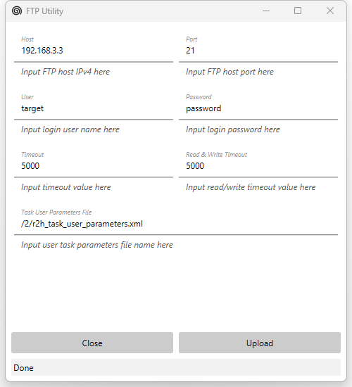

确保主机和控制器位于同一个网段，输入正确的控制器IP后，使用 “Upload” 按钮打开保存在控制器上的配置文件。

> “FTP Upload” 对话框上有大量文本框并提供了默认值，修改这些默认值可以让用户自定义上载过程。如果控制器是三菱R系列C语言控制器，通常只需要修改Host IP地址，其他的内容使用默认值就足够了。

## 编辑

主界面如下

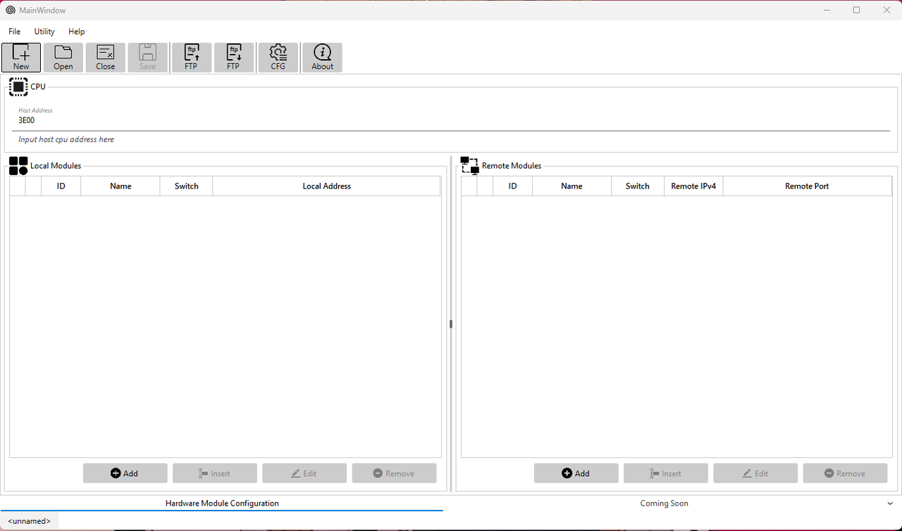

“Xandria”提供硬件模块组态，运行时配置两个主要的编辑功能。

### 硬件模块组态

#### Host CPU Address

直接以16进制数的形式填入以下文本框即可。

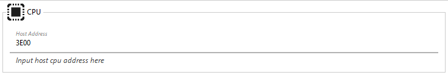

#### ExtensionModules

可以使用“Add”, “Insert”, “Edit” 和 “Remove”来添加，插入，编辑和移除本地扩展模块。

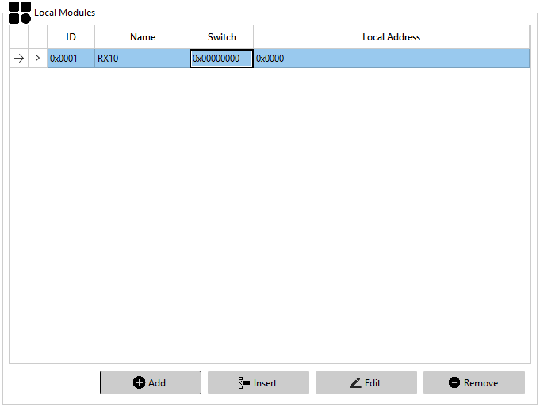

同时，选中已存在的模块并点击鼠标右键，使用上下文菜单也可以进行模块的插入，编辑以及移除。

通过双击已经存在的模块，可以马上编辑已经存在的模块。

> 通过拖拽操作，可以方便地调整已经存在的模块的顺序。

##### 本地模块设置对话框

添加，插入和编辑功能都会打开一个本地模块设置对话框，用户可以在这对话框内，进行模块类型选择，模块各种标准和自定义属性的设置。

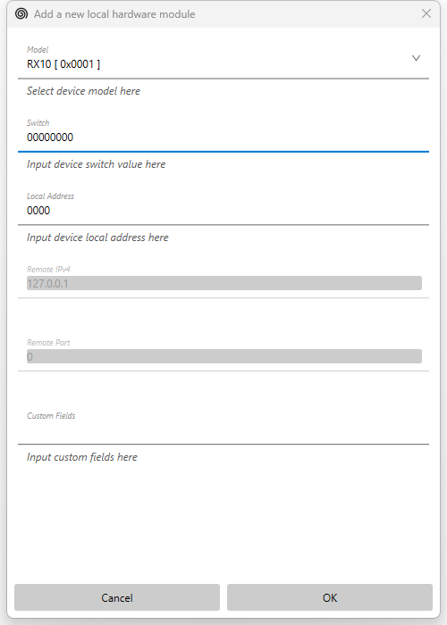

> Switch和Local Address处，请直接输入16进制数字，不需要添加前缀0x。

标准属性和自定义属性的意义参见Orbment Runtime的使用手册，这里不再赘述。

这里简单介绍下自定义属性（Custom Fields）的输入方法。

* 每一行可以输入一个自定义属性。

* 属性的名字和属性的值用冒号“:”分割，例如以下定义的属性，属性的名字是“ENI”，属性的值是“/2/eni.xml”：

通过鼠标左键点击已定义模块头部的向右箭头可以展开显示自定义属性：

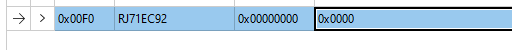

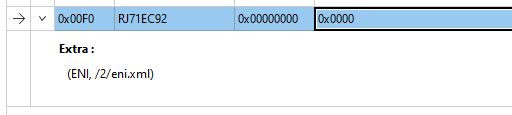

#### EthernetModules

可以使用“Add”, “Insert”, “Edit” 和 “Remove”来添加，插入，编辑和移除以太网扩展模块。

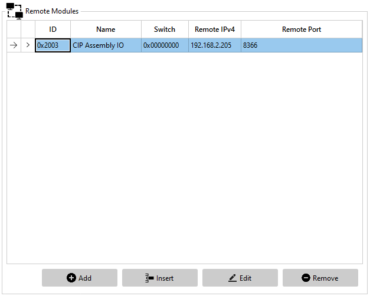

同时，选中已存在的模块并点击鼠标右键，使用上下文菜单也可以进行模块的插入，编辑以及移除。

通过双击已经存在的模块，可以马上编辑已经存在的模块。

> 通过拖拽操作，可以方便地调整已经存在的模块的顺序。

##### 以太网模块设置对话框

添加，插入和编辑功能都会打开一个以太网模块设置对话框，用户可以在这对话框内，进行模块类型选择，模块各种标准和自定义属性的设置。

需要注意的是，“Xandria”仅仅把模块类型，Switch设置， IP地址，Port号作为标准属性，其他的属性均被当作自定义属性，需要用户手动输入，正如下图所示的那样。

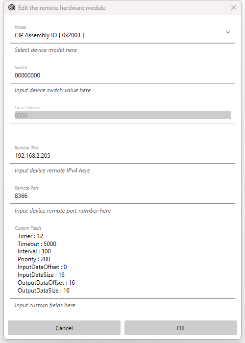

标准属性和自定义属性的意义参见Orbment Runtime的使用手册，这里不再赘述。

自定义属性的输入方法和本地模块自定义参数的输入方法相同，详情请参考ExtensionModules章节，这里也不再赘述。

通过鼠标左键点击已定义模块头部的向右箭头可以展开显示自定义属性，类似ExtensionModules章节内所述的内容。

### 运行时配置

运行时配置需要打开运行时配置专用对话框，你可以使用以下任意一个方法打开这个对话框：

* 工具栏按钮

* 菜单命令 Utility -> RuntimeConfiguration

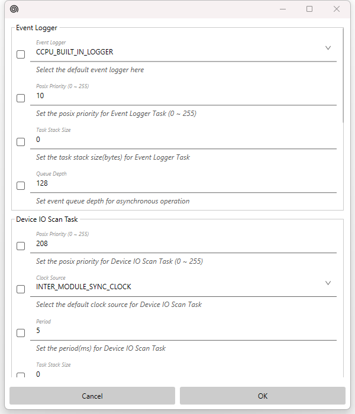

运行时的所有可以配置的参数均可以在这个对话框内找到。

Orbment运行时的所有参数均定义了默认值，如果你需要覆盖这个默认值，**务必先勾选参数前的check box，后输入你想设置的值**，例如以下的例子表示用户想把Event Logger的队列深度改为256。

## 保存

### 本地配置文件

使用以下的任意一个方法保存配置文件到本地磁盘：

* 工具栏按钮

* 菜单命令 File -> Save

* 快捷键 Ctrl + S

使用以下的任意一个方法将配置文件另存到本地磁盘：

* 菜单命令 File -> Save As

* 快捷键 Ctrl + Shift + S

### 控制器上的配置文件

使用以下的任意一个方法保存配置文件到控制器：

* 使用工具栏按钮

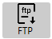

* 菜单命令 Utility -> Download

* 快捷键 Ctrl + F5

以上方法都会打开“FTP Download”对话框：

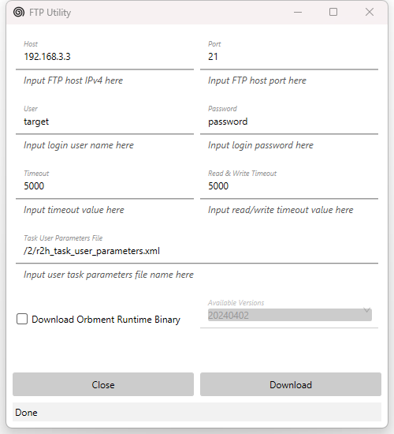

确保主机和控制器位于同一个网段，输入正确的控制器IP后，使用 “Download” 按钮将配置文件保存到控制器。

> “FTP Download” 对话框上有大量文本框并提供了默认值，修改这些默认值可以让用户自定义下载过程。如果控制器是三菱R系列C语言控制器，通常只需要修改Host IP地址，其他的内容使用默认值就足够了。

